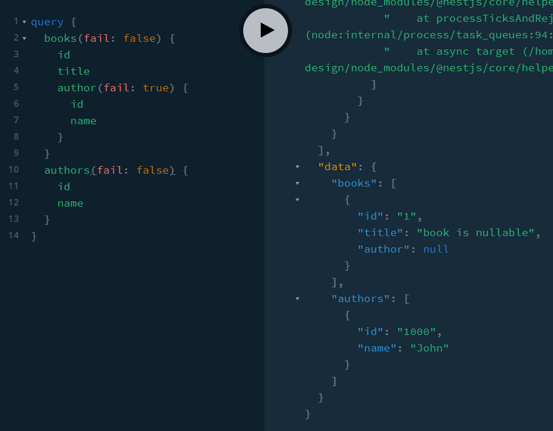
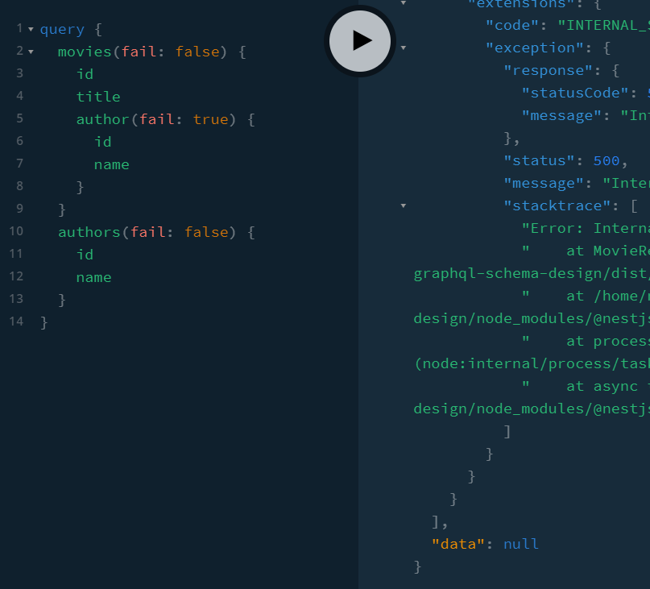

# example-graphql-schema-design

> An example to learn GraphQL schema design

GraphQL のスキーマの nullable/non-null の違いを検証するためのコードです。

## スキーマ定義


`books` は nullable な返り値にして、Field Resolver の author も nullable な返り値にする。

一方で `movies` は non-null な返り値にして、Field Resolver の author も non-null な返り値にする。

引数 `fail` を受け取り、`true` であれば例外を throw することで実験を行う。

## クエリ

### books (nullable)



### movies (non-null)



## 結果

結論から言うと例外が発生すると、発生した field から最も近い nullable な親(自身の field を含む)が `null` になる。

上記実験で言うと、Query.books.author で例外が発生すると自身が nullable なため、`"author": null` となり、Book.id や Book.title は取得できる。
もちろん Query.author も取得できている。

一方で Movie.author で例外が発生すると RootQuery まで nullable な field がないため、何も取得できない。
Query.author すらも取得できなくなる。

また Query.books で例外が発生した場合は、以下のようになる。

```json
"data": {
  "books": null,
  "authors": [
    {
      "id": "1000",
      "name": "John"
    }
  ]
}
```

さらに、例えば Book 型の `author` field が上記画像では nullable であるが、non-null にする。
このとき author の引数 `fail` を `true` にすると最も近い nullable な親は books になるため、`"books": null` という返り値になる。

```json
"data": {
  "books": null,
  "authors": [
    {
      "id": "1000",
      "name": "John"
    }
  ]
}
```

## 考察

失敗する可能性のある返り値は nullable にしていくのが安定だと考えられる。
バックエンド API へのリクエストで ObjectType を組み立てる場合などはデータの取得に失敗する可能性があるため、失敗したとき例外を catch して自分で field を詰め直すのでなければ nullable にすべきだと思う。

ObjectType がもつ各 field についてはバックエンド API の返り値の都合に合わせてできるだけ non-null でいいかもしれない。

GraphQL Server を実装するときは例外がどこまで伝播して `null` になるかを考慮してスキーマ設計を行う必要がありそう。
一方でフィールド引数については可能な限り non-null またはデフォルト引数ありにするほうがいい気がする。
スキーマの後方互換を考えるのが難しい。

フロントエンドからすると non-null な field であれば実装が容易になるが、なんでも non-null にしてしまうと、一部のバックエンド API がダウンした場合に何も表示できなくなってしまう。

GraphQL Client の難しいところは `data` が取得できているが `errors` もある場合があることを考慮しなければならないということな気がする。

## 参考

- [When To Use GraphQL Non-Null Fields](https://medium.com/@calebmer/when-to-use-graphql-non-null-fields-4059337f6fc8)
- [octokit/graphql-schema](https://github.com/octokit/graphql-schema)
