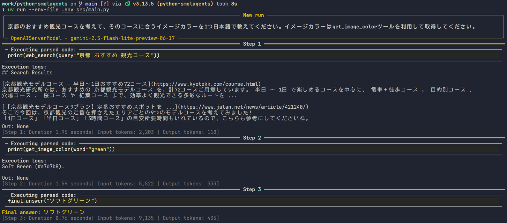

# python-smolagents

> Demo LLM Application with Hugging Face smolagents

## Usage

```sh
$ ty check
$ ruff check
$ ruff format
$ uv run --env-file .env src/main.py
```



## References

- [smolagents](https://huggingface.co/docs/smolagents/index)
- [Smolagents Chat Server Demo](https://github.com/huggingface/smolagents/tree/main/examples/server)
- [HuggingFaceTB/SmolLM3-3B](https://huggingface.co/HuggingFaceTB/SmolLM3-3B)
