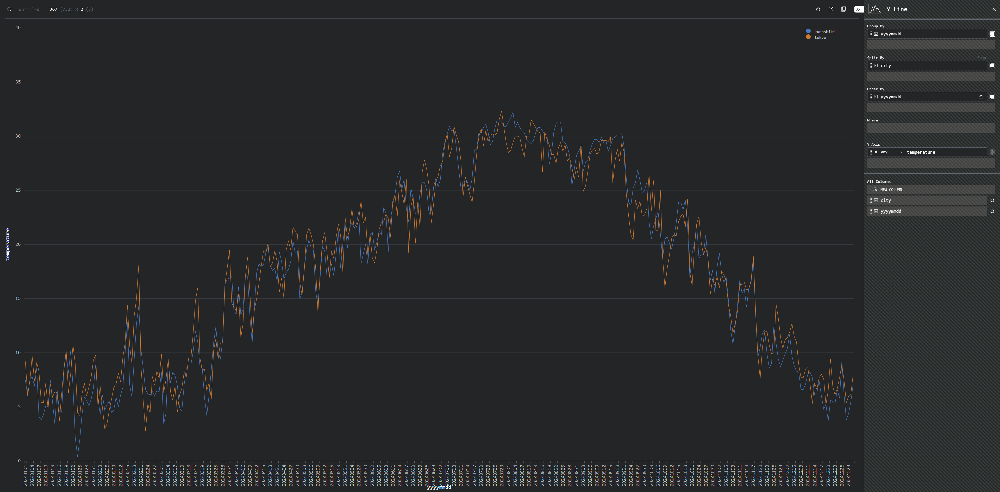

# example-duckdb-visualization

> Visualize trials with DuckDB



## Usage

```sh
$ node ./prepare.ts
$ npm run dev
```

## Notes

- DuckDB を今回は Node.js で使ってみた
- たぶん Wasm でも同様のことはできるはずで、インタラクティブな SQL がほしければそっち
- Evidence と Mosaic はいまいち動かし方が分からなかった
- Observable は触ってないので今度使ってみたい
- DuckDB と Object Storage はだいぶ可能性を感じる
- Vite で Wasm を import するときの型定義どうするのがよいのか？
- DuckDB のみで Arrow の IPC 形式に出力できないのか？

## References

- [過去の気象データ・ダウンロード](https://www.data.jma.go.jp/risk/obsdl/index.php)
- [Evidence](https://evidence.dev/)
- [Mosaic](https://idl.uw.edu/mosaic/)
- [Perspective](https://perspective.finos.org/)
- [Observable](https://observablehq.com/framework/)
