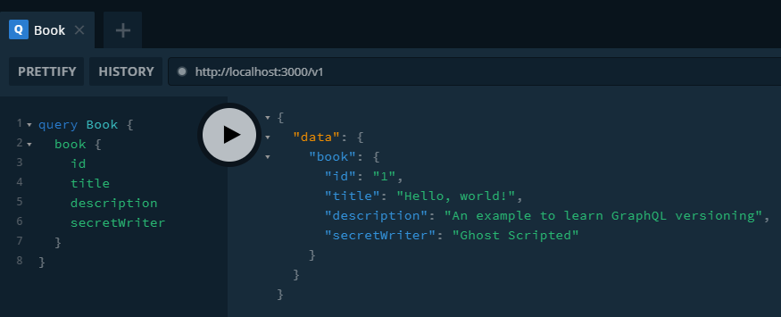
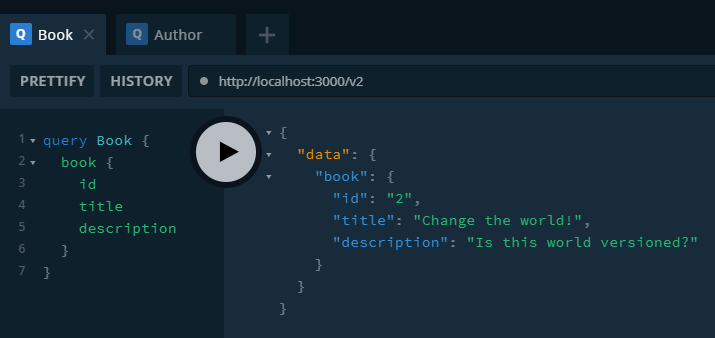
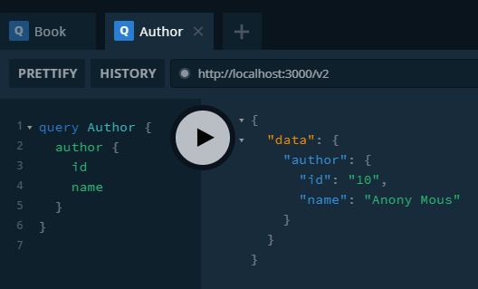

# example-graphql-versioning

> An example to learn GraphQL versioning

GraphQL の versioning をコード内でする手法を実験します。

## 想定

v1 のスキーマから `secretWriter` という field を削除しなければならなくなった、というシナリオを想定します。

GraphQL では versioning を推奨していないため、本来であれば `secretWriter` field は `@deprecated` を用いて移行期間を設けた後に削除すべきですが、何らかの理由で移行期間を設けることができず後方互換を保てなくなった場合に versioning する必要があると思います。

## スキーマ変更

追加

- Query.author

削除

- Book.secretWriter

## 結果

v1 での実行結果

v2 での実行結果

## 考察

コードレベルで versioning することは可能と言えそう。
ただし本実験では検証していないが application logger や project configuration をどうやって管理するかも検討する必要があると思う。
config も versioning する必要がありそうだけど、どうやるべきなのか。
Redis など接続している周辺コンポーネントにも影響がないか考慮する必要がある。
キャッシュの key が衝突してしまうなどが考えられそう。

GraphQL では versioning を推奨しないというのも理解しているつもり。
要求する field だけを返すため、新規で追加した field については client 側が知っていなくても問題ないため versioning しなくても field を追加するだけで問題ない。

スキーマの変更がある場合も Datasource の後方互換が保てているのであれば、新規の field を生やして、既存の field を deprecated にして移行期間を設ければよいはず。

スキーマの変更とは以下のものを示す。

- field 名の変更
- Object Type の変更
  - 型の変更
  - null 許容への変更
- 引数の変更
  - 必須の引数の追加
  - 型の変更
  - non-null への変更

以上より GraphQL の versioning はいくつかの方法を考えられる。

- Datasource の後方互換が保てる場合
  - 新規 field を追加し、移行期間を設ける
- Datasource の後方互換が保てない場合
  - コードレベルでバージョンを分ける (本実験)
  - アプリケーションレベルでバージョンを分ける

後方互換が保てない場合の対応を行う際は、旧バージョンをどのように管理するかを慎重に検討しないと事故りそう。

## 参考

- [GraphQL Best Practices](https://graphql.org/learn/best-practices/)
- [「GraphQL API だとバージョニングが不要」という言明は誤解を招くので避けるべき](https://gfx.hatenablog.com/entry/2018/07/18/114712)
- [Versioning fields in GraphQL](https://blog.logrocket.com/versioning-fields-graphql/)
